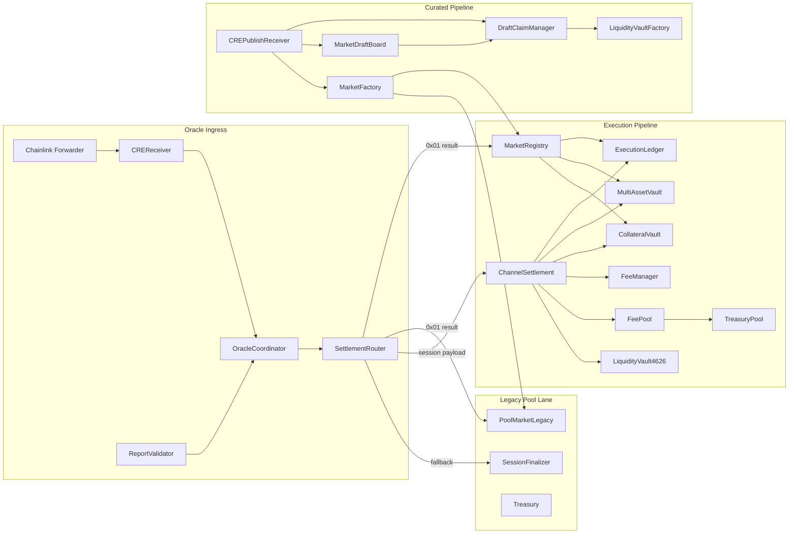
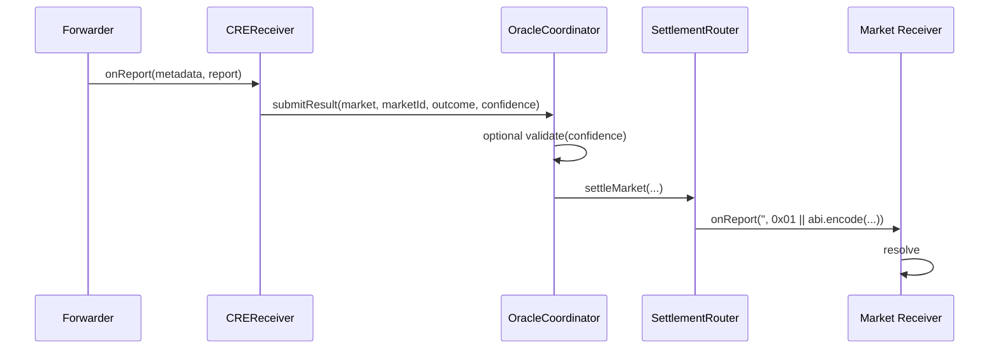
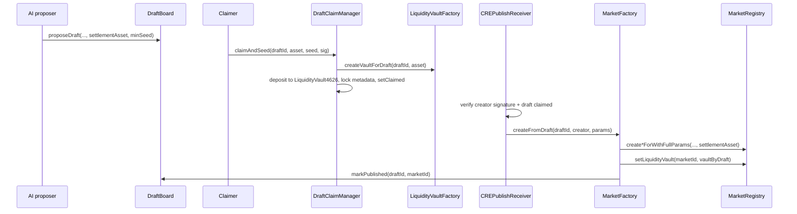
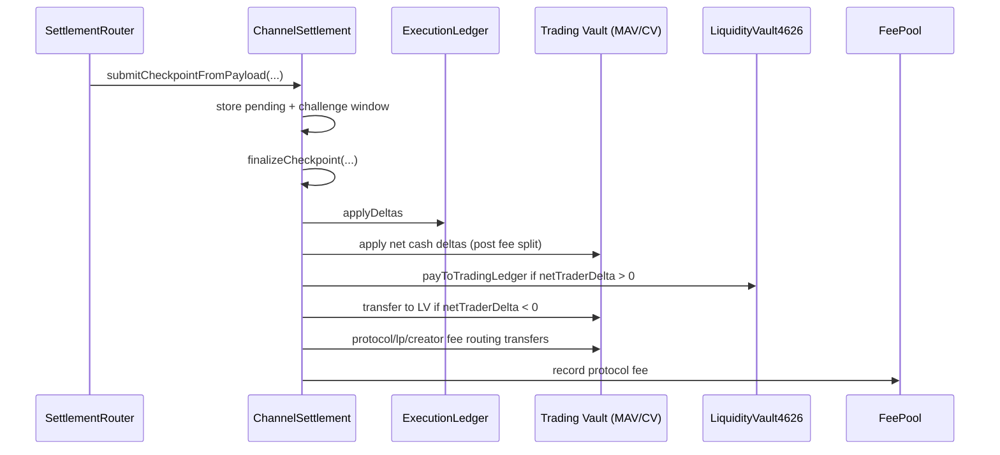

# RetroPick Current Smart Contract Architecture (Post-ChangesTarget2)

Last updated: 2026-02-16  
Scope: `packages/contracts/src` + `packages/contracts/test`  
Validation snapshot: `forge test -q` passes on this state.

## 1) Executive Architecture Summary

The current system is now a hybrid of:

1. Oracle ingress and routing pipeline
- `ReceiverTemplate` -> `CREReceiver` -> `OracleCoordinator` -> `SettlementRouter`

2. Curated market supply pipeline (Draft -> Claim -> Publish)
- `MarketDraftBoard`
- `DraftClaimManager` (legacy `claimDraft` + new `claimAndSeed`)
- `LiquidityVaultFactory` (per-draft ERC-4626 vault deployer)
- `CREPublishReceiver`
- `MarketFactory.createFromDraft`

3. Execution settlement pipeline (checkpoint-based)
- `ChannelSettlement`
- `ExecutionLedger`
- `MarketRegistry`
- `CollateralVault` or `MultiAssetVault`
- `FeeManager` + `FeePool` + `TreasuryPool`
- optional market liquidity vault per market via `MarketRegistry.liquidityVaultByMarketId`

4. Legacy pool market lane (still active in code/tests)
- `PoolMarketLegacy`
- `SessionFinalizer`
- `Treasury` (optional escrow helper)

Major upgrade now present:
- Settlement logic includes LP-vault counterparty flow and fee splitting (`protocol/lp/creator`) in `ChannelSettlement`.
- Curated drafts now include `settlementAsset` and `minSeed`, and `claimAndSeed` path mints ERC-4626 shares.

## 2) High-Level Topology

## 3) Contract Inventory and Roles

## 3.1 Core

- `src/core/MarketRegistry.sol`
  - canonical market metadata + settlement + redeem in execution lane.
- `src/core/MarketFactory.sol`
  - CRE market creation (v1/v2) and curated `createFromDraft`.
- `src/core/SettlementRouter.sol`
  - routes validated outcomes and session payloads.
- `src/core/SessionFinalizer.sol`
  - legacy snapshot payout finalizer.
- `src/core/PoolMarketLegacy.sol`
  - pool-based predict/claim + new add/reduce position behavior.
- `src/core/Treasury.sol`
  - optional escrow helper.

## 3.2 Oracle

- `src/oracle/CREReceiver.sol`
- `src/oracle/OracleCoordinator.sol`
- `src/oracle/ReportValidator.sol`

## 3.3 Curation

- `src/curation/MarketDraftBoard.sol`
- `src/curation/DraftClaimManager.sol`
- `src/curation/MarketPolicy.sol`
- `src/curation/CREPublishReceiver.sol`
- `src/curation/LiquidityVaultFactory.sol`

## 3.4 Execution + Liquidity

- `src/execution/ChannelSettlement.sol`
- `src/execution/ExecutionLedger.sol`
- `src/execution/CollateralVault.sol`
- `src/execution/MultiAssetVault.sol`
- `src/execution/CollateralVaultAdapter.sol`
- `src/execution/LiquidityVault4626.sol`

## 3.5 Fees

- `src/fees/FeeManager.sol`
- `src/fees/FeePool.sol`
- `src/fees/TreasuryPool.sol`

## 4) Trust Boundaries and Authority Model

## 4.1 Ingress trust

- `ReceiverTemplate` enforces sender forwarder and optional workflow metadata checks.
- `CREReceiver` only transforms payload routing and delegates trust to coordinator.

## 4.2 Routing trust

- `OracleCoordinator.submitResult/submitSession` only callable by configured `creReceiver`.
- `SettlementRouter.settleMarket/finalizeSession` only callable by configured `oracleCoordinator`.

## 4.3 Settlement trust

- `ChannelSettlement` trusts:
  - `operator` checkpoint signature
  - user signature list
  - nonce/challenge window constraints

## 4.4 Admin trust

- Owners can rewire coordinator/router/vault/fee endpoints and policy values.
- Critical owner-gated ops include:
  - `ReportValidator.setMinConfidence`
  - `Treasury.setMarketApproved`
  - registry/router/vault address setters across modules

## 5) Data Models (Current Implementation)

## 5.1 `MarketDraftBoard.Draft`

Stores:
- identity: `questionHash`, `questionURI`, `marketType`, `outcomesHash`, `outcomesURI`
- policy/time: `resolveSpecHash`, `tradingOpen`, `tradingClose`, `resolveTime`
- economics: `settlementAsset`, `minSeed`
- lifecycle: `status`, `creator`, `proposedAt`

Status lifecycle:
- `Proposed -> Claimed -> Published`
- or `Cancelled/Expired`

## 5.2 `MarketRegistry.Market`

Stores:
- creator and question
- timing: `tradingOpen`, `tradingClose`, `resolveTime`, `expiry`
- settlement: `settled`, `frozen`, `confidence`, winning outcome

Associated mappings:
- `settlementAssetByMarketId`
- `liquidityVaultByMarketId`
- typed market outcomes/windows and winning index
- `hasRedeemed[marketId][user]`

`status(marketId)` derivation:
- missing creator => `Draft`
- settled => `Resolved`
- frozen => `Frozen`
- else => `Open`

## 5.3 Checkpoint types

`ShadowTypes.Checkpoint`:
- `marketId`, `sessionId`, `nonce`
- `validAfter`, `validBefore`
- `lastTradeAt`
- `stateHash`, `deltasHash`, `riskHash`

`ShadowTypes.Delta`:
- `user`, `outcomeIndex`, `sharesDelta`, `cashDelta`

`ChannelSettlement.Pending`:
- pending nonce
- challenge deadline
- persisted hashes + `lastTradeAt`

## 5.4 Vault states

- `CollateralVault`: free/locked balances by user.
- `MultiAssetVault`: free/locked balances by `(asset, user)` and per-session lock key.
- `LiquidityVault4626`: ERC-4626 shares and asset pool (per draft via factory deployment).

## 6) End-to-End Flows

## 6.1 Oracle outcome flow

Receivers currently used:
- `MarketRegistry` (execution lane)
- `PoolMarketLegacy` (legacy lane)

## 6.2 Curated claim-and-seed + publish flow

Important current behavior:
- `createFromDraft` uses draft settlement asset and full timing params.
- Liquidity vault binding depends on `DraftClaimManager` being configured in factory and a nonzero vault for draft.

## 6.3 Checkpoint settlement flow

## 6.4 Redeem flow

- User calls `MarketRegistry.redeem(marketId)`.
- Registry resolves winning outcome index.
- Reads `ExecutionLedger.positionOf(user, marketId, winningOutcome)`.
- If positive and not redeemed before, pays from:
  - `MultiAssetVault.redeemPayout(user, asset, amount)` if configured
  - else `CollateralVault.redeemPayout(user, amount)`.

## 7) Detailed Contract Mechanics

## 7.1 `DraftClaimManager` (new economics path)

New path:
- `claimAndSeed(draftId, asset, seedAmount, deadline, sig)`
- Enforces:
  - draft must be `Proposed`
  - signature validity on typed `ClaimAndSeed`
  - liquidity vault factory configured
  - `seedAmount >= draft.minSeed`
  - asset matches draft settlement asset (if set)
- Actions:
  - deploy/get per-draft `LiquidityVault4626`
  - pull tokens from claimer to manager
  - approve + deposit into vault on behalf of claimer
  - store claim and lock metadata
  - call `draftBoard.setClaimed`

Legacy path still present:
- `claimDraft(...)` without seed deposit.

## 7.2 `LiquidityVaultFactory` + `LiquidityVault4626`

Factory:
- idempotent vault deployment per `draftId`
- callable by any address

Vault:
- ERC-4626 wrapper over one asset
- settlement hook `payToTradingLedger(to, amount)` only callable by configured `channelSettlement`

## 7.3 `MarketFactory.createFromDraft`

Current curated creation behavior:
- gated by `approvedPublishReceivers`
- reads draft settlement asset
- resolves timing from params with fallback to draft fields
- uses full-param create functions in `MarketRegistry`
- if draft has liquidity vault in `DraftClaimManager`, calls `marketRegistry.setLiquidityVault`
- marks draft published and maps `draftIdByMarketId`

CRE feed creation behavior (non-curated):
- still supports v1/v2 market input payloads (`0x02` for v2 typed)
- creates markets via `PREDICTION_MARKET` interface target (now often `PoolMarketLegacy` in tests)

## 7.4 `ChannelSettlement` fee and net-flow model

During `_applyCashDeltasAndFees`:
- determines settlement asset via registry (`getSettlementAsset`) in multi-asset mode.
- for each positive trader `cashDelta`, calls `FeeManager.computeSplit`.
- accumulates `protocolFee`, `lpFee`, `creatorFee`.
- applies net `cashDelta` set to trading vault.
- computes `netTraderDelta = sum(net cash deltas)`.

During `finalizeCheckpoint`:
- settlement invariants checked.
- applies share deltas first.
- applies cash deltas and fee accounting.
- reads market liquidity vault from registry.
- if liquidity vault exists:
  - `netTraderDelta > 0`: LP vault pays trading vault
  - `netTraderDelta < 0`: trading vault pays LP vault
- routes fees:
  - protocol fee -> `FeePool` (if configured and channel is feeCollector)
  - lp fee -> LP vault donation if LP shares exist, else fallback to treasury
  - creator fee -> market creator address

## 7.5 `FeeManager` split semantics

- `protocolFeeBps` is total fee rate cap-limited to 2%.
- fee split percentages:
  - `lpFeeShareBps`
  - `creatorFeeShareBps`
  - remainder goes to protocol bucket
- `computeSplit` returns `(protocolFee, lpFee, creatorFee, netDelta)`.

## 7.6 `PoolMarketLegacy` trading update

New behavior versus old one-shot model:
- users can add to existing same-outcome position.
- cannot add directly to opposite outcome without reducing first.
- new reducers:
  - `reducePosition`
  - `reduceAll`
  - typed equivalents
- prediction claim remains pro-rata pool payout post-settlement.

## 8) Access-Control Matrix (Current)

| Contract | Operation | Guard |
|---|---|---|
| `ReportValidator` | `setMinConfidence` | `onlyOwner` |
| `Treasury` | `setMarketApproved` | `onlyOwner` |
| `OracleCoordinator` | `submitResult/submitSession` | `msg.sender == creReceiver` |
| `SettlementRouter` | `settleMarket/finalizeSession` | `msg.sender == oracleCoordinator` |
| `SettlementRouter` | market settlement target | optional allowlist |
| `MarketRegistry` | `resolve` | `msg.sender == settlementRouter` |
| `MarketRegistry` | createFor/withParams + setLiquidityVault | `msg.sender == marketFactory` |
| `ExecutionLedger` | `applyDeltas` | `msg.sender == channelSettlement` |
| `CollateralVault` | mutating settlement functions | `msg.sender == channelSettlement` |
| `MultiAssetVault` | mutating settlement functions | `msg.sender == channelSettlement` |
| `LiquidityVault4626` | `payToTradingLedger` | `msg.sender == channelSettlement` |
| `MarketDraftBoard` | propose draft | `AI_ORACLE_ROLE` |
| `MarketDraftBoard` | mark published | `PUBLISH_CALLER_ROLE` |

## 9) Invariants Enforced in Code Today

1. Checkpoint signer coverage
- every delta user must be signed.
- duplicate signer list entries are rejected.

2. Nonce monotonicity + challenge window
- stale/replayed checkpoint nonces rejected.
- finalize before challenge deadline rejected.

3. Market close boundary
- `lastTradeAt > tradingClose` rejected at finalize.

4. Resolution authority
- direct unauthorized market resolve rejected.

5. Fee cap
- total fee bps capped in `FeeManager`.

6. Typed market bounds
- outcome/windows cardinality and index validity enforced.

## 10) ChangesTarget2 Mapping (Current)

## 10.1 Implemented

- Draft includes `settlementAsset` + `minSeed`.
- `claimAndSeed` path implemented with ERC-4626 deposit.
- Per-draft liquidity vault deployment (`LiquidityVaultFactory`).
- Market creation binds to full timing params in curated flow.
- Registry stores `liquidityVaultByMarketId`.
- Settlement includes:
  - net trader delta reconciliation with LP vault
  - protocol/lp/creator fee split routing
- Pool market supports add/reduce/switch flow for positions.

## 10.2 Partial

- Seed lock is metadata-only today:
  - `seedSharesLocked` and `seedUnlockTime` are tracked
  - but shares are minted directly to claimer wallet and not escrowed/locked at token-transfer level.

- Claim = seed is not mandatory globally:
  - legacy `claimDraft` still allows draft claim without seed.
  - publish path accepts claimed drafts regardless of whether claim used seed path.

- Multi-asset routing is implemented in settlement/redemption but not fully universal across all non-curated creation inputs.

## 10.3 Missing relative to broader target vision

- Resolution dispute manager (`ResolutionManager`) with bond/evidence/challenge lifecycle.
- Checkpoint v2 transcript fields (`epoch/accountsRoot/txRoot/prevStateHash/policyHash`).
- Risk sentinel/manager enforcement hooks.
- CCIP gateway + market mirror cross-chain modules.

## 11) Current Risks / Technical Debt (Implementation-Exact)

1. LP solvency depends on vault funding presence
- If no liquidity vault bound to market, net trader delta reconciliation step is skipped.

2. Seed lock is not hard-enforced on ERC-4626 shares
- `unlockSeedShares` emits state/event only; no transfer restriction is enforced on actual shares.

3. Draft claim path duality
- `claimDraft` and `claimAndSeed` coexist; policy does not force seeded claims in publish flow.

4. Session routing event semantics
- `SettlementRouter.finalizeSession` emits `MarketSettled(address(0),0,0,0)` placeholder event rather than dedicated session route event.

5. `LiquidityVaultFactory.createVaultForDraft` is open callable
- idempotent and safe in practice, but not role-restricted.

## 12) Test Coverage Snapshot

Covered by current tests:

- Security hardening: `test/SecurityHardening.t.sol`
- Checkpoint validity/lifecycle: `test/CheckpointFlow.t.sol`
- Fee extraction basics: `test/FeeFlow.t.sol`
- Curated flow + claimAndSeed path: `test/CurationFlow.t.sol`
- Oracle ingress/routing: `test/OracleFlow.t.sol`
- Typed market creation: `test/MarketTypes.t.sol`
- Legacy session finalization fallback: `test/YellowSessionFlow.t.sol`
- Pool add/reduce/switch position behavior: `test/PoolMarketTrading.t.sol`

## 13) Practical Current Production Path

For this architecture state, the intended lane is:

1. Curated draft proposal with settlement asset and min seed.
2. Prefer `claimAndSeed` (not legacy claim) so liquidity vault exists.
3. Publish via `CREPublishReceiver` -> `MarketFactory.createFromDraft`.
4. Trade offchain, settle checkpoints through `ChannelSettlement`.
5. Resolve via oracle path into `MarketRegistry`.
6. Redeem through registry from configured vault path.

This document describes current onchain behavior exactly as implemented in this repository state.

---

## 14) 2026-02-17 Deep Current-System Extension (Authoritative Addendum)

Date of verification: 2026-02-17  
Validation rerun on this state: `forge test -q` passes.

This section extends the document with implementation-exact details from `src/**` and `test/**`.

## 14.1 Scope Clarification

There are effectively two production-relevant lanes and one compatibility lane:

1. Primary lane (recommended):  
`MarketDraftBoard -> DraftClaimManager.claimAndSeed -> CREPublishReceiver -> MarketFactory.createFromDraft -> MarketRegistry -> ChannelSettlement -> (MultiAssetVault or CollateralVault) -> redeem`

2. Oracle resolution lane:  
`CREReceiver -> OracleCoordinator -> SettlementRouter -> MarketRegistry.onReport(0x01...)`

3. Legacy compatibility lane (kept for demo/backward compatibility):  
`PoolMarketLegacy` + optional `SessionFinalizer`

## 14.2 Concrete Wiring Requirements (Deployment Truth)

For curated + checkpoint lane to work end-to-end, these links must be set:

- `MarketRegistry.marketFactory = MarketFactory`
- `MarketRegistry.settlementRouter = SettlementRouter`
- `MarketRegistry.multiAssetVault` optional, but if set then `setDefaultSettlementAsset` should also be set
- `ExecutionLedger.channelSettlement = ChannelSettlement`
- `CollateralVault.channelSettlement = ChannelSettlement`
- `CollateralVault.marketRegistry = MarketRegistry` (for redeem)
- if using MAV: `MultiAssetVault.channelSettlement = ChannelSettlement` and `MultiAssetVault.marketRegistry = MarketRegistry`
- `ChannelSettlement.marketRegistry = MarketRegistry`
- optional fee lane: `ChannelSettlement.feeManager`, `ChannelSettlement.feePool`, `FeePool.feeCollector = ChannelSettlement`
- `SettlementRouter.oracleCoordinator = OracleCoordinator`
- optional `SettlementRouter.channelSettlement` for checkpoint payload routing
- fallback-only `SettlementRouter.sessionFinalizer` if no `channelSettlement`
- `OracleCoordinator.creReceiver = CREReceiver`
- `OracleCoordinator.settlementRouter = SettlementRouter`
- optional `OracleCoordinator.reportValidator = ReportValidator`
- curated lane:
- `MarketFactory.marketRegistry = MarketRegistry`
- `MarketFactory.draftBoard = MarketDraftBoard`
- `MarketFactory.draftClaimManager = DraftClaimManager` (required for strict seeded publish enforcement)
- `MarketFactory.approvedPublishReceivers[CREPublishReceiver] = true`
- `MarketDraftBoard.draftClaimManager = DraftClaimManager`
- `MarketDraftBoard.PUBLISH_CALLER_ROLE` granted to `MarketFactory`
- `DraftClaimManager.liquidityVaultFactory = LiquidityVaultFactory`

## 14.3 `createFromDraft` Is Now Strictly Seed-Gated (When ClaimManager Is Configured)

Behavior in current code:

- caller must be approved publish receiver (`UnauthorizedPublishReceiver` otherwise)
- curated path must be configured (`CuratedPathNotConfigured` otherwise)
- draft times in payload cannot override draft (`DraftTimeMismatch`)
- if `draftClaimManager` is set, claim type must be `SEEDED` (`SeededClaimRequired`)
- if draft has `minSeed > 0`, liquidity vault must exist (`SeededClaimRequired`)
- if vault asset and draft settlement asset differ, revert (`InvalidLiquidityVaultAsset`)
- on success:
- market created with full params from draft times
- vault bound via `MarketRegistry.setLiquidityVault`
- draft marked published and reverse-linked via `draftIdByMarketId`

This is stricter than older behavior described earlier in this doc.

## 14.4 Seed Locking Is Onchain-Enforced at Share Custody Level

Current `DraftClaimManager.claimAndSeed` flow:

- transfers seed asset from claimer to manager
- deposits into vault with receiver = `DraftClaimManager` (not claimer)
- stores `seedSharesLocked[draftId]` and `seedUnlockTime[draftId]`
- unlock path transfers vault shares from manager to claimer only after unlock time

So seed lock is no longer metadata-only; shares are actually custody-locked in manager until `unlockSeedShares`.

## 14.5 Checkpoint Pipeline: Exact Guarantees

`ChannelSettlement` enforces:

- bounded payload (`MAX_DELTAS=256`, `MAX_USERS=256`)
- `users.length == userSigs.length`
- `hash(deltas) == cp.deltasHash`
- validity window (`validAfter`, `validBefore`)
- operator signature must recover to configured `operator`
- every user signature must recover over checkpoint digest
- `users` must be unique
- every delta user must appear in `users`
- nonce strictly increasing over finalized nonce
- challenge constraints:
- pending must exist
- within challenge window
- replacement nonce must be newer than pending nonce

Finalize enforces:

- pending exists and challenge window has elapsed
- finalize deltas hash equals stored pending hash
- if registry is set:
- market must not be resolved
- `lastTradeAt <= tradingClose` when `tradingClose != 0`
- applies share deltas first (`ExecutionLedger`)
- then cash deltas + fees
- then LP counterparty transfers
- then protocol/lp/creator fee routing
- writes finalized nonce and clears pending

## 14.6 Cash and Fee Semantics (Current Math)

Fee logic (`FeeManager`) on positive `cashDelta` only:

- `totalFee = profit * protocolFeeBps / 10000`
- split of `totalFee`:
- protocol bucket: `1 - lpShare - creatorShare`
- LP bucket: `lpFeeShareBps`
- creator bucket: `creatorFeeShareBps`
- trader net cash delta = `profit - totalFee`

No fee applied to zero/negative trader deltas.

`ChannelSettlement` aggregates per-checkpoint:

- `protocolFee`, `lpFee`, `creatorFee`
- `netTraderDelta = sum(net trader cash deltas)`

Then:

- if LP vault exists:
- `netTraderDelta > 0`: LP vault pays trading vault (`payToTradingLedger`)
- `netTraderDelta < 0`: trading vault transfers asset to LP vault
- protocol fee:
- transferred to `FeePool` only when `feePool.feeCollector == ChannelSettlement`
- LP fee:
- donated to LP vault when LP vault exists and has `totalSupply > 0`
- otherwise fallback to treasury pool (if configured)
- creator fee:
- transferred to market creator (if non-zero creator)

## 14.7 LP Solvency Safety Flag

`MarketRegistry.setLiquidityVault` sets:

- `liquidityVaultByMarketId[marketId] = vault`
- `usesLpVaultByMarketId[marketId] = true` if vault non-zero (sticky flag)

`ChannelSettlement.finalizeCheckpoint` then enforces:

- if `usesLpVaultByMarketId == true` and current `liquidityVaultByMarketId == 0`, revert `LiquidityVaultRequired`

This prevents silently finalizing LP-designated markets without a bound LP vault.

## 14.8 Settlement Asset Resolution Logic

`MarketRegistry.getSettlementAsset(marketId)` precedence:

1. explicit `settlementAssetByMarketId[marketId]`
2. if `multiAssetVault != 0` and `defaultSettlementAsset != 0`, use default
3. fallback to `CollateralVault.token()`

Implication: if MAV is used without per-market asset and without default asset, flows can still fall back to vault token semantics through existing compatibility assumptions.

## 14.9 Curated Security Model (EIP-712 Paths)

`DraftClaimManager` signatures:

- `ClaimDraft(...)` typed EIP-712 with user nonce
- `ClaimAndSeed(...)` typed EIP-712 with user nonce

`CREPublishReceiver` signatures:

- `PublishFromDraft(draftId, paramsHash, chainId, nonce)` typed EIP-712
- signer must match `creator == claimer(draftId)`
- nonce increments per creator

Receiver-level authenticity:

- `CREPublishReceiver` and `CREReceiver` inherit `ReceiverTemplate`
- forwarder check enforced unless intentionally disabled
- optional workflow metadata checks available (`workflowId`, `author`, `workflowName`)

## 14.10 MarketRegistry Lifecycle Nuances

- `freeze(marketId)` is permissionless and only sets frozen when `block.timestamp >= tradingClose`
- `resolve` restricted to settlement router
- `onReport` also restricted to settlement router and expects `0x01` report prefix
- typed outcome bound checks are enforced at resolve
- `redeem` is one-shot per `(marketId, user)` and reads winning `shares` from `ExecutionLedger`

Payout source in redeem:

- MAV path if configured
- else single-asset vault path

## 14.11 Legacy Pool Lane: Current Intent

`PoolMarketLegacy` currently supports:

- binary + categorical + timeline market creation
- additive same-outcome position updates
- explicit position reduction (`reducePosition`, `reduceAll`, typed variants)
- settlement via `onReport(0x01 || abi.encode(...))`
- pro-rata payout from pooled collateral

This lane remains functional but is not the recommended production lane for checkpoint-based settlement architecture.

## 14.12 Session Routing Behavior

`SettlementRouter.finalizeSession(payload)`:

- only callable by `oracleCoordinator`
- if `channelSettlement` configured:
- decodes checkpoint payload
- forwards to `submitCheckpointFromPayload`
- emits `SessionPayloadRouted(..., routeType=1)`
- else if `sessionFinalizer` configured:
- forwards raw payload to finalizer
- emits `SessionPayloadRouted(..., routeType=0)`
- else revert `InvalidAddress`

`onlySessionFinalizer` modifier exists but is currently unused in function entrypoints.

## 14.13 Test-Backed Guarantees (Current)

From current tests:

- `CheckpointFlow.t.sol`: hash mismatch, bad sigs, nonce monotonicity, challenge window checks
- `SecurityHardening.t.sol`: unsigned delta user rejection, unauthorized resolve rejection, post-close trade timestamp rejection
- `CurationFlow.t.sol`: seeded publish requirement, draft-time mismatch rejection, share lock custody in manager, wrong-asset precreate replacement handling, unlock gating
- `FeeFlow.t.sol` + `FuzzFeeSplit.t.sol`: fee split math and boundary behavior
- `InvariantSolvency.t.sol`: LP vault requirement and settlement solvency invariants
- `SessionRouting.t.sol`: session payload routing and emitted route events
- `OracleFlow.t.sol`: CRE -> coordinator -> router -> market settlement flow
- `PoolMarketTrading.t.sol`: add/reduce/switch position behavior in legacy lane

## 14.14 Operational Checklist (Recommended)

Before enabling production traffic:

1. Keep `ReceiverTemplate` forwarder validation enabled on all receiver contracts.
2. Configure `draftClaimManager` in `MarketFactory` to enforce seeded publish path.
3. Set and verify `LiquidityVaultFactory.channelSettlement`.
4. Set `MarketRegistry.defaultSettlementAsset` when using MAV and markets may omit explicit asset.
5. Wire `FeePool.feeCollector = ChannelSettlement` or protocol fee collection events will not represent actual custody moves.
6. Disable/avoid legacy lane routing in production if not needed.
7. Keep `ReportValidator.minConfidence` at policy-approved threshold.

## 14.15 Superseded/Ambiguous Earlier Notes

The following earlier statements in this document should now be interpreted with this addendum:

- Earlier note saying seed lock is metadata-only is no longer accurate for current code; lock is custody-enforced via manager-held vault shares.
- Earlier note saying publish accepts claimed drafts regardless of seeded path is no longer accurate when `MarketFactory.draftClaimManager` is configured; `SEEDED` claim is enforced by `createFromDraft`.

This addendum is the source of truth for the 2026-02-17 repository state.
